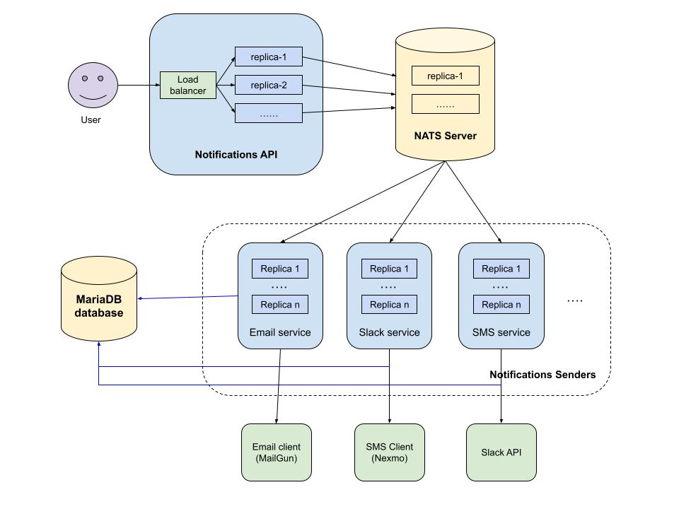

# Notifications system

## Overview 
Notifications sending system supporting Email, SMS and Slack channels.

## Architecture
<!--  -->


Assuming the system is running in kubernetes, all components below could be deployments with the needed numbers of replicas depending on the system load. 

- `Notifications API` - the first component of the system is REST API service. It's main purpose is to receive notifications in JSON format and publish them into a Message Queue (NATS server). There is a different subject per channel and each message is published to the appropriate subject.

- `NATS Server` - Message Queue receiving the messages. 

- `Notifications senders` - microservice that is subscribed for the NATS subjects and send the notifications. Sent notifications and their status are kept into a database. 
A cron job is checking for failed notifications and retries the operation. Each channel like slack, email and sms could be enabled/disabled in the service configuration. Thank to that, the following configurations are possible:
    - single instance sending notifications to all channels
    - separate instance per channel where particular channel is enabled, rest disabled (shown on the architecture diagram above)

- `MariaDB database` - store sent notifications and their status. 

- `Observability` - the system could be observed via time series metrics exported by each component and scraped by `Prometheus` (or any other metrics engine). The metrics could be used for observability dashboards (with `Grafana`) or defining alerting rules. Based on the observability, each component of the system could be scaled in and out depending on the load.


## Endpoints

- `v1/notifications` - send notification to the channels described in the body. The JSON body structure:
```json
{
    "message": "string",
    "email": {
        "to": "string",
        "cc": "string"
    },
    "sms": {
        "phone": "number"
    },
    "slack": {
        "channel": "string"
    }
}
```

## Usage
### Prerequisits
- Docker and Docker Compose installed

### Run the system
- Go to the home directory of the project and run:
```
make start
``` 
- Notifications endpoint could be accessed through localhost on the following url:
```
http://localhost:59191/
```

### Tests

#### Manual tests 
Set of API requests is prepared in `tests/api-requests.http`. The requests can be executed directly from the file using `Visual Studio Code` and `REST Client` extension. This is an easy option for manual testing.

#### Unit tests
Couple of unit tests are available for each services in the project. They are more of an example what needs to be done. Production readiness requires much better test coverage. Tests could be started with `make tests` command.

### Stop the system
`make stop` stops all running containers and clean up the resources created by run the application.
